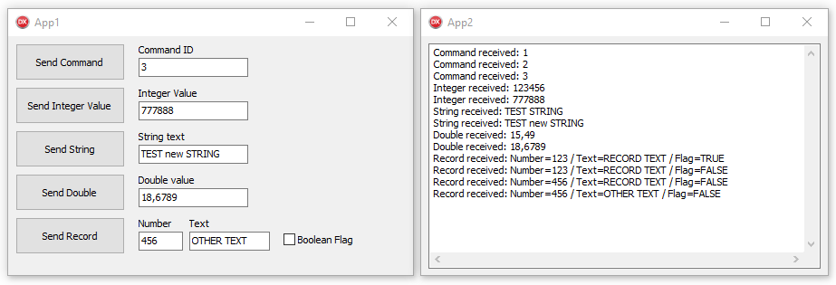

# DzTalkApp

## Delphi non-visual component to communicate between applications


- [Component Description](#component-description)
- [Installing](#installing)
- [How to use](#how-to-use)
- [Properties](#properties)
- [Methods](#methods)
- [Events](#events)
- [How to send and read custom types](#how-to-send-and-read-custom-types)



## Component Description

DzTalkApp allows you to send data between distinct applications. You can send simple data type like Integer or String, and even complex data, like a record.

## Installing

### Auto install

Close Delphi IDE and run **CompInstall.exe** app to auto install component into Delphi.

### Manual install

1. Open **DzTalkApp** package in Delphi.
2. Ensure **Win32** Platform and **Release** config are selected.
3. Then **Build** and **Install**.
4. If you want to use Win64 platform, select this platform and Build again.
5. Add sub-path Win32\Release to the Library paths at Tools\Options using 32-bit option, and if you have compiled to 64 bit platform, add sub-path Win64\Release using 64-bit option.

Supports Delphi XE2..Delphi 10.3 Rio

## How to use

Drop a TDzTalkApp in the source and destination applications.

You just need to set the window name in the component, and the communication will occur between window handles.

In the destination application, just set the OnMessage event to receive and read data.

## Properties

`AutoActivate: Boolean` = Auto-enable the handle on component loaded. This will only works when you set other properties in design-time mode.

`AutoFind: Boolean` = When AutoFind is enabled, on each Send command, the component will find the destination window handle.

`MyWindowName: String` = Specify the source handle name. This property is only needed if this app will receive communication. Otherwise you only need to set the destination window name.

`DestWindowName: String` = Specify the destination window name. This property is only needed if this app will send communication, otherwise you only need to set the source window handle name.

`Synchronous: Boolean` = If this property is enabled, when you send a command to other app, the execution pointer will be released only after the destination app method `OnMessage` ends. If this property is disabled, when the destination receive the message, immediately the execution pointer is released in the source application.

`Active: Boolean` (public read-only) = Indicates if the component is enabled or disabled (see `Enable` and `Disable` methods).

`ToHandle: HWND` (public) = Stores the last destination window handle. You can set this property manually if needed, but I recommend you to use `FindDestWindow` method instead.

## Methods

```delphi
procedure Enable;
```

Enables the window handle to send and receive messages. You need to specify the name of window handle before use this method.

```delphi
procedure Disable;
```

Disables the window handle.

```delphi
procedure FindDestWindow;
```

Find and set destination window handle by the name defined in `DestWindowName` property. If the destination window is not found, an error is raised, using class `EDzTalkAppWndNotFound`.

```delphi
procedure Send(ID: Word); overload;
procedure Send(ID: Word; N: Integer); overload;
procedure Send(ID: Word; A: AnsiString); overload;
procedure Send(ID: Word; P: Pointer; Size: Integer); overload;
```

Use **Send** methods to send a message to destination application. To send messages, the component needs to be enabled (use `Enable` method) and needs a destination window name defined (use `DestWindowName` property).

The overloads methods allows you to send:

- Only a command, using `ID` parameter

- A command with an Integer parameter, using `N` parameter

- A command with a String parameter, using `A` parameter

- A command with any kind of data parameter, using `P` parameter and specifying the size of data parameter.

```delphi
function AsString: AnsiString;
```

Use this function inside the OnMessage event to get a message data as String type.

```delphi
function AsInteger: Integer;
```

Use this function inside the OnMessage event to get a message data as Integer type.

## Events

```delphi
procedure OnMessage(Sender: TObject; From: HWND; ID: Word; P: Pointer);
```

This method will occur in the destination app when a message is received. The `From` parameter indicates the handle of the source window. The `ID` parameter indicates the code of the message used in the `Send` method at the source app. The `P` parameter has the pointer of the message data.

You can use the `AsString` or `AsInteger` functions to read messages as String and Integer data types.

## How to send and read custom types

### Record types:

You can send record structure. To do this, ensure you are always using `packed record`, because this kind of record will use a fixed size structure.

**To send a record, use:**

```delphi
type
  TData = packed record
    Number: Integer;
    Text: ShortString;
    Flag: Boolean;
  end;
  
var R: TData;
begin
  R.Number := 100;
  R.Text := 'TEST';
  R.Flag := True;
  
  DzTalkApp.Send(1, @R, SizeOf(R));
end;
```

**To receive this record using OnMessage event:**

```delphi
var R: TData;
begin
  R := TData(P^);
end;
```

> Of course, the packed record on destination application must have the same structure as the record used in the sender application.

### Simple types:

**To send a Double type:**

```delphi
var D: Double;
begin
  DzTalkApp.Send(1, @D, SizeOf(D));
end;
```

**To receive a Double type (OnMessage event):**

```delphi
var D: Double;
begin 
  D := Double(P^);
end;
```
